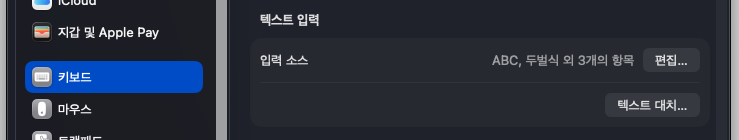
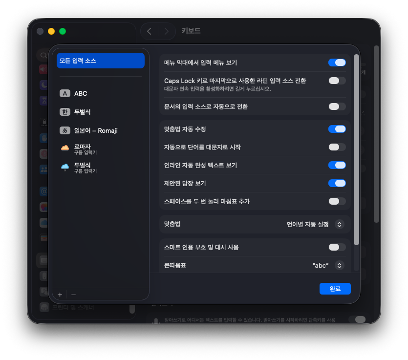
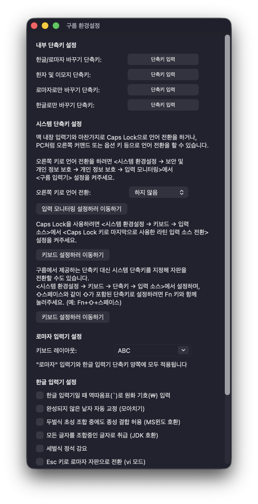
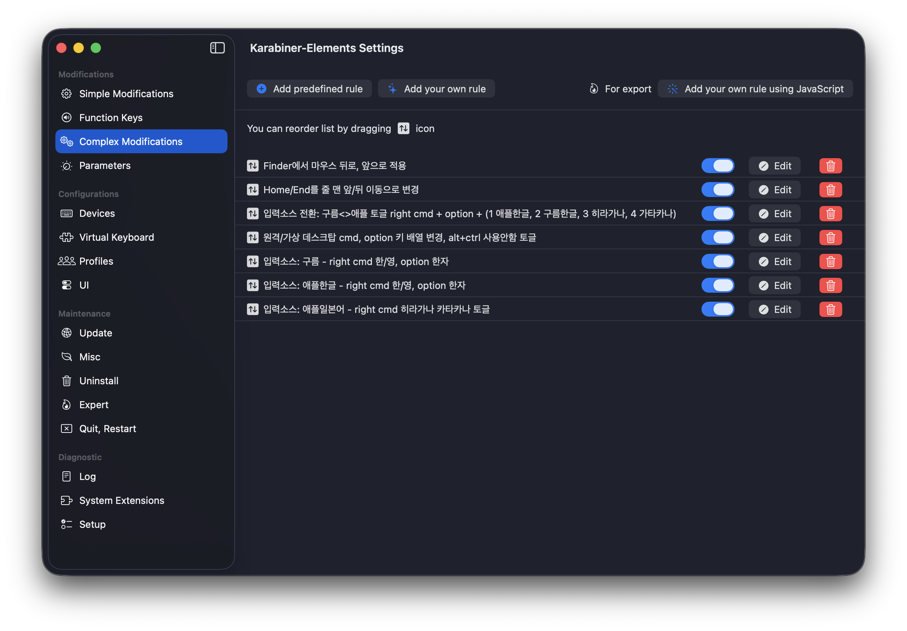

# 구름 입력기 cli + 카라비너 엘리먼트 설정

* 이 프로젝트의 기본 목적은 맥의 언어전환 버그의 우회와 오른쪽 cmd, option 의 한/영, 한자 키 할당 입니다.
* 구름 입력기는 자체적으로 모든 입력 소스가 모든 입력방식을 지원하여, 입력 소스 전환이 제대로 안되었을 경우에도 내부적으로 전환되어 버그를 우회합니다.
* 하지만, 제3자 입력기라서 발생하는 보안 문제로 추측되는 문제로 구름이 처리하는 이벤트가 앱까지 전달되는 문제가 남습니다. [#919](https://github.com/gureum/gureum/issues/919)
* 구름 입력기의 단축키엔 오른쪽 cmd, option 을 단독으로 등록할 수 없어서 ctrl+option+, 같은 단축키에 할당하면 터미널에 전달됩니다.
* 이에, 구름 입력기에게 단축키 처리를 맡기지 않고 karabiner elements 를 이용하여 이벤트 처리를 하도록 cli 도구를 만들었습니다. [#923](https://github.com/gureum/gureum/pull/923)

## 준비사항

### homebrew

* karabiner-elements : 가상 키보드 드라이버를 설치하여 최상위에서 키보드 이벤트를 완전히 제어합니다.
* macism : 맥의 입력 소스 전환시 자주 발생하는 메뉴 막대 표기만 바뀌고 실제 입력 소스 전환이 안되는 버그를 포커스 전환으로 우회하는 도구 입니다. 포커스 전환이라는 방식 때문에 전환 후 타자가 가능하기 까지 시간이 좀 걸립니다.
* gureumkim : 입력 소스 전환시 자체적으로도 전환하여 버그를 우회하는 구름 입력기 입니다.

```bash
brew install --cask karabiner-elements
brew tap laishulu/homebrew
brew install macism
brew install --cask gureumkim
```

### 구름 입력기 설치 후 입력 소스 추가

* 시스템 설정 > 키보드 > 텍스트 입력 > 입력 소스 > 편집
* 좌 하단 +
* 한국어, 영어 둘 모두 구름 아이콘이 있는 것으로 추가해야 합니다.
* 입력 소스가 안보이면 스크롤을 죽죽 내리면서 아무거나 마구 선택한 후 다시 한국어로 돌아오면 나타납니다.
* 메뉴 막대의 구름 입력기를 클릭하고 환경설정에 들어가서 모든 단축키를 해제합니다.



{: width="500" height="976"}

## 간단한 버전

[inputsource.gureum.simple.json](./inputsource.gureum.simple.json)
* 한영 : right cmd
* 한자 : right option
* 구름 입력기 상태가 아닌 경우 right cmd : 구름 영문으로 돌아옵니다. 간단한 예제라 macism 을 사용 안해서 버그가 발생할 수 있습니다.

## 카라비너 엘리먼트 본격적인 활용

* 애플 기본 한글에서 macism 으로 전환, 일본어 전환, 입력 소스 전환과 관련이 없는 설정들도 있으니 참조하여 적용하세요.

### home, end 키

[home.end.json](./recommend/home.end.json)
* 브라우저 등 에서 문서의 처음과 끝이 아닌 줄의 처음과 끝으로 변경
* 앱에 따라 ctrl + a,e 와 cmd + left,right 중 선택 적용하면 됩니다.
* 적용 앱 : slack, chrome, safari, edge, firefox, opera, whale, [mark](https://playloom.app/mark)

### 언어별 입력 소스 전환

[inputsource.change.json](./recommend/inputsource.change.json)
* 구름<>애플 토글 : right cmd + option
* 애플 한글 : right cmd + option + 1
* 구름 한글 : right cmd + option + 2
* 히라가나 : right cmd + option + 3
* 카타카나 : right cmd + option + 4

### 원격/가상 환경 윈도우를 위한 키배열 변경

[remote.desktop.json](./recommend/remote.desktop.json)
* 적용 앱 : Chrome Remote Desktop, Windows App, UTM
* 왼쪽 option > left win
* 왼쪽 cmd > left alt
* 오른쪽 cmd > right alt
* 오른쪽 option > right ctrl
* 위 변경사항 적용 안함 토글 : right cmd + option 

### 구름 입력기

[inputsource.gureum.json](./recommend/inputsource.gureum.json)
* 한영 : right cmd
* 한자 : right option

### 애플 한글

[inputsource.han2.json](./recommend/inputsource.han2.json)
* 한영 : right cmd
* 한자 : right option

### 애플 일본어

[inputsource.japanese.json](./recommend/inputsource.japanese.json)
* 히라가나/카타카나 토글 : right cmd

### 적용 순서

* 먼저 설정된 것이 적용되므로 되도록 이 순서로 맞추는 것이 좋습니다.


## 구름 세벌씩390 2,3 (Shift + ,.) 문제 우회

[inputsource.gureum.han390fix.json](./inputsource.gureum.han390fix.json)
* 이 우회법은 karabiner-elements 만으로 동작합니다.